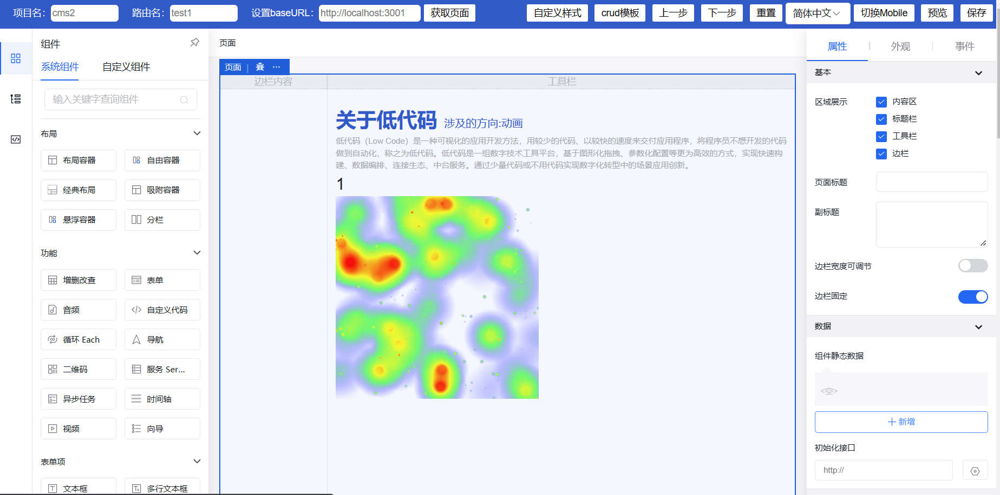

# 背景

你是否在做中后台项目中经常要重复做 crud 的业务逻辑，花费大量时间还时常有 bug 发生，但是现在只要几分钟就能让你快速连通前后端，拖拉拽实现后台业务逻辑。你就问香不香！

# 关于

🚀 ✈️ 🚁 lowcode-editor-send 基于 amis-editor（React + TS），通过封装 json 数据上报、配置、自定义组件等，实现低代码管理后台实时更新，无需手动写 json 配置。如果你要在 Vue 中使用当然也可以。👍 简单一句话： 你不用敲代码了！！

# 原理

抽空实现了最简单版本的低代码框架，方便你快速理解

Easy-Lowcode https://github.com/ccj-007/easy-lowcode

# 沟通

#### 觉得不错点个 star ⭐ 再走 ！

#### QQ 交流群 565896756

# 预览



# 开始

```
  npm i           //安装依赖
  npm run start   //通过devaServe启动前端页面, 默认3000端口
  npm run server  //启动node服务，默认3001端口
  npm run build   //打包（某些情况可能会存在内存溢出问题）
```

# 功能

1. url 跳转 √
2. 历史记录修改 √
3. 预览、重置、i18n 切换、切换移动端 √
4. 配置更新前端 lowcode 页面 √
5. 支持切换环境 √
6. 编辑器打包 (关闭 sourcemap 和 node 内存溢出问题处理， 15M 体积) √
7. 新增 crud 模板、css 样式模板 √
8. 自定义组件：
    - 自定义标题组件 √
    - 倒计时组件 √
    - 热力图组件 √

# 自定义组件

1. 请在项目 src 文件夹下的 customComponents 组件中根据已有示例配置即可，在 renderer 做 jsx 的渲染工作，plugin 做组件的基础配置
2. 如何存在不确定的配置，可以在如下类型文件中查找对应 api

-   在 node_modules/amis/lib/Schema.d.ts 里面定义了组件的类型
-   在 node_modules/amis-editor/src/component/schemaTpl.tsx 定了 tab 面板配置的类型

3. getSchemaTpl 返回的事先定义的多组件的模板，panelBody 配置可以获取物料的基础组件。所以通常我们会将 getSchemaTpl 和 panelBody 混用

```js
// src/customComponents/HeatMap/plugin.ts
{
  //...
  panelBodyCreator(context: any) {
    let panelConfig = getSchemaTpl("tabs", [
      {
        title: "接口",
        body: [
          getSchemaTpl("switch", {
            name: "initFetch",
            label: "初始是否拉取",
          }),
          getSchemaTpl("api", {
            name: "api",
            label: "接口地址",
            description:
              " 接口存在跨域问题，需要后端代理，请在此填写接口地址",
          }),
        ],
      },
    ])
    let panelBody = [
      {
        title: "常规",
        controls: [
          {
            name: "preview",
            label: "是否预览",
            type: "checkbox",
          },
          {
            name: "json_heatmap",
            label: "热力图的json配置",
            type: "json-editor",
            onChange: (e: any) => {
              const id = context.id;
              const { manager } = this;
              const { store } = manager;
              const node = store.getNodeById(id);
              console.log((e));
							//在配置的事件中可以控制组件的渲染 ！
              const component = node.getComponent();
              // component.api(val);
            }
          },
        ],
      },
      {
        title: "外观",
        body: [getSchemaTpl("className"),
        getSchemaTpl("icon"),
        getSchemaTpl("combo-container"),
        getSchemaTpl("hidden"),
        getSchemaTpl("switchDefaultValue"),
      ],
      },
    ]
    panelConfig.tabs.unshift(...panelBody)
		return [
			panelConfig
		]
	}
}
```

# 自定义组件如何集成 SDK

具体可以看官方用法，这里做了一个打包自定义组件的工作，并在 html 中引入

```js
//rollup.config.js
const config = {
    input: "src/customComponents/renderer.ts",
    output: {
        dir: "comp-sdk",
        format: "es",
        globals: {
            react: "React",
        },
        plugins: [
            getBabelOutputPlugin({
                presets: ["@babel/preset-react"],
            }),
        ],
    },
    acornInjectPlugins: [jsx()],
    plugins: [
        clear({
            targets: ["./comp-sdk/"],
        }),
        resolve(),
        commonjs(),
        babel({
            presets: [
                [
                    "@babel/preset-react",
                    {
                        development: false,
                    },
                ],
            ],
            babelHelpers: "bundled",
        }),
        typescript({
            jsx: "preserve",
        }),
        json(),
        postcss(),
        terser(),
        cleanup(),
    ],
}

export default config
```

通过 rollup 打包为 esm 模块，最终打包自定义组件的库会输出在`/comp-sdk`，下面展示具体 html 中的引入

```html
<div id="root" class="app-wrapper"></div>
<script>
    var process = { env: { NODE_ENV: "development" } }
</script>
<script type="module" src="./comp-sdk/renderer.js"></script>
<script src="./sdk/sdk.js"></script>
<script type="module">
    let React = amisRequire("react")
    let amis = amisRequire("amis/embed")
    let amisLib = amisRequire("amis")
    console.log("compRenderMap", compRenderMap)

    //注册自定义组件
    function generator(map) {
        for (const key in map) {
            let reg = eval("/(^|\\/)" + key + "/")
            amisLib.Renderer({
                test: reg,
            })(map[key])
        }
    }
    generator(compRenderMap)

    let amisScoped = amis.embed("#root", {
        type: "page",
        title: "表单页面",
        body: {
            type: "form",
            mode: "horizontal",
            api: "/saveForm",
            body: [
                {
                    label: "title",
                    type: "custom-title",
                    name: "title",
                },
                {
                    label: "countdown",
                    type: "custom-countdown",
                    name: "countdown",
                },
            ],
        },
    })
</script>
```

# 注意

1. 本地调试请在 server 文件夹下定义好文件名，本地调用通过文件名对应路由名。如果需要数据库连接，请定义好项目名和路由名等字段用于查询。json 配置在原来基础上，已经做了一个包裹, 核心数据配置在 json 属性内，为了方便定位以及后期维护扩展。

2. 在编辑中极有可能遇到点错导致页面丢失问题，可以做个发布的版本备份功能

```js
{
  "json": {
    "type": "page",
    "title": "Hello world",
    "body": [
    ]
  },
  "routeName": "test2.json",
  "itemName": "cms2"
}
```

# 核心

```js
//src/App.tsx
import * as React from "react";
import { Editor } from "amis-editor";
import "./App.css";
import axios from "axios";
import crudTpl from "./tpl/crud.json"; //json文件默认可以在src目录下导入
import { proxy } from "ajax-hook";  //拦截amis内部ajax请求
import { SchemaObject } from "amis/lib/Schema"; //json数据类型
import { MyRendererPlugin } from "./MyRendererPlugin";
import { registerEditorPlugin } from 'amis-editor';

registerEditorPlugin(MyRendererPlugin); //自定义组件

interface StateType {
  json: any;
  routeName: string;
  itemName: string;
  preview: boolean;
  historyList: Object[];
  step: number;
  maxHistoryNum: number;
  baseURL: string;
  isCustomStyle: boolean
  linkDOM: HTMLElement | null
}

type InputType = React.RefObject<HTMLInputElement>

class App extends React.Component<any, StateType> {
  baseURLRef: InputType = React.createRef()
  itemNameRef: InputType = React.createRef()
  routeNameRef: InputType = React.createRef()

  constructor(props: any) {
    super(props);
    this.state = {
      json: {},
      routeName: window.localStorage.getItem("lowcode_routeName") || "test1", //test1对应server文件夹下的json的文件名（本地调试）
      itemName: window.localStorage.getItem("lowcode_itemName") || "cms2",
      preview: false,
      historyList: [],
      step: 0,
      maxHistoryNum: 10,
      baseURL: window.localStorage.getItem("baseURL") || "http://localhost:3001", //正式开发环境请自行修改
      isCustomStyle: window.localStorage.getItem("lowcode_style") === 'true' ? true : false,
      linkDOM: null,
    };
  }
  componentDidMount() {
    //拦截处理
    proxy({
       // ...
    });

    //获取url query
    this.checkQuery();
    setTimeout(() => {
      this.getJSON();
    }, 0);
  }

  // 通过接口获取json对象
  getJSON = () => {
     // ...
  };

  // 通过接口保存json对象
  sendJSON = () => {
     // ...
  };

  //监听lowcode的json改变
  handleChange = (e: any) => {
     // ...
  };

  //获取query
  checkQuery = () => {
     // ...
  };

  // 获取查询字符串
  getQueryString = (name: string) => {
     // ...
  };

  //监听项目名输入
  inputItemName = () => {
     // ...
  };
  //监听路由输入
  inputRouteName = () => {
     // ...
  };
  //根路径
  inputUrlName = () => {
     // ...
  };

  //开始预览
  startPreview = () => {
     // ...
  };
  //重置
  clearJSON = () => {
     // ...
  };

  //上一步
  backHistoryJSON = () => {
     // ...
  };
  //下一步
  goHistoryJSON = () => {
     // ...
  };

  //设置自定义样式
  setStyles = () => {
    // ...
  };
  //crud模板
  setTpl = () => {
    // ...
  };

  /**
   * 转为domain, 注： 这里内部是无法拦截axios的请求，所以这里直接对序列化的字符串做替换
   * 但是这种做法存在很容易出错，所以我们直接拦截ajax请求。
   */
  changeBaseURLtoDomain = (obj: any) => {
    // ...
  };
  //转为${baseURL}
  chengeDomaintoBaseURL = (obj: any) => {
    // ...
  };

  render() {
    return (
      <>
        {/* ......  */}
        <Editor
          value={this.state.json}
          onChange={this.handleChange}
          preview={this.state.preview}
        />
      </>
    );
  }
}

export default App;

```

**调整：** 在编辑器中你无法拦截到内部 amis 的 axios 请求实例，所以在原来的处理中域名是直接 json 解析，不方便处理，现在通过 ajax-hooks 库直接拦截 ajax 请求，可以根据业务配置你的请求头、域名等。

```sh
 npm i ajax-hook
```

```js
import { proxy } from "ajax-hook"

//拦截处理
proxy({
    onRequest: (config, handler) => {
        // config.headers = headers;  在这里处理通用请求头
        config.url = this.state.baseURL + config.url //处理url
        handler.next(config)
    },
    onError: (err, handler) => {
        console.log(err.type)
        handler.next(err)
    },
    onResponse: (response, handler) => {
        console.log(response.response)
        handler.next(response)
    },
})
```

# 后端服务

```js
//server/app.js  用于调试服务端
const http = require("http")
const fs = require("fs")
const path = require("path")

/**
 * 失败数据模型
 * @param {*} msg 消息
 */
function errModel(msg) {
    let obj = {
        success: false,
        msg,
    }
    return JSON.stringify(obj)
}

http.createServer(function (req, res) {
    res.setHeader("Access-Control-Allow-Origin", "*")
    res.setHeader("Access-Control-Allow-Headers", "Content-Type")
    res.setHeader("Content-Type", "application/json;")
    res.setHeader("Access-Control-Allow-Methods", "DELETE,PUT,POST,GET,OPTIONS")
    console.log(req.url)
    console.log(req.method)
    if (req.method == "OPTIONS") {
        res.writeHead(200, {
            "Content-Type": "text/plain",
            "Access-Control-Allow-Origin": "*",
            "Access-Control-Allow-Headers":
                "Content-Type, Content-Length, Authorization, Accept, X-Requested-With , yourHeaderFeild, sessionToken",
            "Access-Control-Allow-Methods": "PUT, POST, GET, DELETE, OPTIONS",
        })
        res.end("")
    }

    if (req.method === "POST" && req.url === "/api/setJSON") {
        let item = ""
        // 读取每次发送的数据
        req.on("data", function (chunk) {
            item += chunk.toString()
        })
        // 数据发送完成
        req.on("end", function () {
            let items = JSON.parse(item)
            if (items.routeName && items.itemName) {
                let file = path.join(__dirname, `${items.routeName}.json`)
                // json文件需要存入路径
                fs.writeFileSync(file, item)
                //将数据返回到客户端
                res.write(item)
                res.end()
            } else {
                res.write(errModel("文件配置失败, 检查路由或项目名是否正确"))
                res.end()
            }
        })
    }

    //本地模拟直接用client-admin.json
    if (req.method === "POST" && req.url === "/api/getJSON") {
        let item = ""
        // 读取每次发送的数据
        req.on("data", function (chunk) {
            item += chunk.toString()
        })
        // 数据发送完成
        req.on("end", function () {
            let items = JSON.parse(item)

            if (items.routeName && items.itemName) {
                let file = path.join(__dirname, `${items.routeName}.json`)

                fs.readFile(file, "utf-8", function (err, data) {
                    if (err) {
                        console.log(err)
                        res.write(errModel("请检查路由是否正确"))
                        res.end()
                    } else {
                        let obj = JSON.parse(data)
                        res.write(JSON.stringify(obj.json))
                        res.end()
                    }
                })
            } else {
                res.write(errModel("请检查路由或项目名是否正确"))
                res.end()
            }
        })
    }
}).listen(3001) // 监听的端口
```

## 如何在 Vue 的前端项目中使用 ？

### 1. 在静态目录 public 中的 index.html 引入对应的 sdk，sdk 官网有可以自行下载

```js
  <link rel="stylesheet" href="./lowcode/amis/antd.css" />
  <link rel="stylesheet" href="./lowcode/amis/iconfont.css" />
  <script src="./lowcode/amis/sdk.js"></script>
```

### 2. 在路由允许的情况下调用封装的方法，即可渲染 lowcode 页面

```js
import Vue from "vue"
import defaultConfig from "./config"
import axios from "axios"

var timer = null

let defaultOptions = {
    method: "local", // 'http' | 'local' 通过接口返回或者本地静态文件夹获取
    routeName: "", //输入路由名（必填）
    itemName: "", //项目名（必填）
}
let newOptions //修改后的配置
/**
 * 在路由允许的情况下调用可生成对应lowcode页面
 * @param {DOM} DOM
 * @param {Object} options
 */
export const getLowcodePage = (DOM, options = {}) => {
    newOptions = Object.assign(defaultOptions, options)
    let { routeName } = newOptions
    if (!DOM || !routeName) {
        throw new Error("DOM or routeName is no exist")
    }

    //handle first render error
    const check = routeName => {
        let dom = document.querySelector(DOM)
        if (dom) {
            getJsonFs(routeName)
            if (!timer) {
                clearTimeout(timer)
            }
        } else {
            timer = setTimeout(() => {
                check(routeName)
            }, 0)
        }
    }

    //get json
    const getJsonFs = routeName => {
        if (newOptions.method === "local") {
            Vue.http
                .get(
                    `lowcode/pages/${routeName}.json`,
                    {},
                    { emulateJSON: true }
                )
                .then(res => {
                    let obj = JSON.parse(res.bodyText)
                    if (obj) {
                        startAmis(obj)
                    }
                })
                .catch(error => {
                    console.log("error", error)
                })
        }

        if (newOptions.method === "http") {
            //正式项目需要通过post请求传入对象{routeName, itemName}
            //目前调试使用，注意某些跨域情况在vue.config.js中做跨域代理
            axios
                .post(
                    "/api/getJSON",
                    {
                        routeName: options.routeName,
                        itemName: options.itemName,
                    },
                    {
                        headers: {
                            "Content-Type": "application/json",
                        },
                    }
                )
                .then(res => {
                    let { data } = res
                    startAmis(data)
                    console.log("http", data)
                })
                .catch(e => {
                    alert("获取后端json失败" + JSON.stringify(e))
                })
        }
    }

    //amis render
    const startAmis = jsonObj => {
        console.log("jsonObj", jsonObj)
        let amis = window.amisRequire("amis/embed")
        amis.embed(
            DOM,
            jsonObj,
            {
                data: {
                    baseUrl: process.env.VUE_APP_API_BASE_URL,
                },
            },
            defaultConfig
        )
    }

    //entrance
    check(routeName)
}
```

### 3. 做跨域代理

1. 在 create-react-app 中跨域

```js
//package.json
{
  "proxy":"http://localhost:3001", //你要跨域的地址，默认会匹配替换/api
}

//App.tsx
componentDidMount() {
		proxy({
			onRequest: (config, handler) => {
        //取消根路径配置即可跨域
				// config.url = this.state.baseURL + config.url;
			},
		});
	}
```

2. 在 vue 中跨域

```js
  //vue.config.js
  devServer: {
    proxy: {
      //测试lowcode使用
      '/api': {
        target: 'http://localhost:3001',
        changeOrigin: true,
      },
    }
  },
```

### 4. 开始调用方法

```js
<template>
  <div id='main-lowcode'>
    <div id="content-lowcode">
    </div>
  </div>

</template>

<script>
import { getLowcodePage } from '@/lowcode/index'

export default {
  data() {
    return {}
  },
  created() {},
  mounted() {
    // 获取lowcode页面
    getLowcodePage('#content-lowcode', {
      method: 'http', //'http'代表接口请求，注意如果是'local',请在public文件夹中放入json配置文件，即可本地获取json页面
      routeName: 'client-admin',
      itemName: 'cms2'
    })
  }
}
</script>
```

# 总结

### 实现以上基本能快速将中后台系统集成进低代码页面, 甚至单独搭建一个低代码管理后台。 可谓是 crud 的解决办法的神器。

---

### 问题 1: 如果在集成中的样式需要做到统一？

可以在 amis 包的 amis.css 修改，建议根据原有中后台系统配色修改，独立引入 html。在编辑器中针对不同的中后台项目，已经封装了可以通过按钮预览对应的样式的页面，在/public/styles 可以配置修改。

### 问题 2: 如何自定义组件？

如果存在定制化的组件，也是可以通过自定义组件的方式引入，在 src/customComponents 里面已经定义了一个示例，后期会新增更多自定义组件。。

### 问题 3： 如何处理权限？

可以通过 JSON 的解析，找到对应的 disabled 字段，做对应的修改即可

### 问题 4： 哪里找到大量的模板？

https://aisuda.bce.baidu.com/amis/examples/index

### 问题 5：真正如何托拉拽实现，前端不用敲代码！

在实践中不能敲代码，那么真正用编辑器实现一个 crud 的功能，会遇到一些坑，如对应的返回的数据格式可以有适配器转换，查询功能和实际列表展示，一定要注意映射字段的处理。在批量处理中一定要后端必须传入 id。列表中的一些字段其实也可以用映射，按需展示，修改等。
